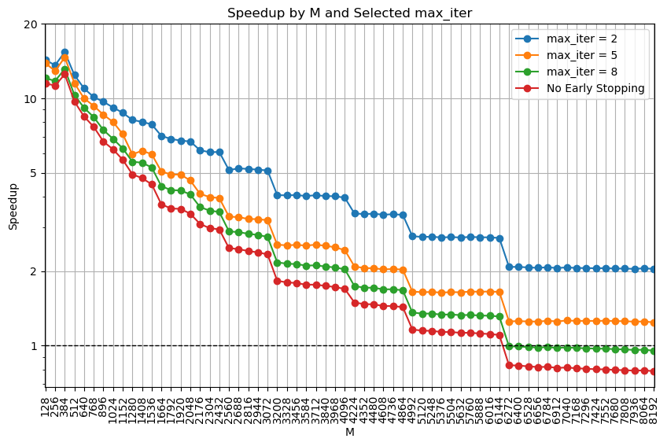

# RTopK
Official Implementation of "RTop-K: Ultra-Fast Row-Wise Top-K Selection for Neural Network Acceleration on GPUs"

Please cite our paper if you use the code ✔
```
@inproceedings{
  xie2025rtopk,
  title={RTop-K: Ultra-Fast Row-Wise Top-K Selection for Neural Network Acceleration on GPUs},
  author={Xi Xie and Yuebo Luo and Hongwu Peng and Caiwen Ding},
  booktitle={The Thirteenth International Conference on Learning Representations},
  year={2025},
  url={https://openreview.net/forum?id=PHg4rAXFVH}
}
```

## Clone and build the project
```sh
git clone https://github.com/xiexi51/RTopK.git
cd RTopK
mkdir build
cd build
cmake ..
make
```

## Run the test
```sh
./rtopk
```

## Switch to No Early Stopping Version
You can either:
- Pass a sufficiently large `max_iter` value (e.g., `10000`) when running the algorithm.
- Or comment out `#define EARLY_STOP` in `rtopk_kernel.cu` and rebuild to achieve slightly higher performance.

## Performance
Speedup of RTopK compared to PyTorch for different vector sizes M and number of vectors N = 65536.

Considering the lower-bound speed of RTopK (no early stopping version):

- When M is below 1280, RTopK achieves more than a 5× speedup over PyTorch.
- When M is between 1280 and 3072, RTopK achieves a 2× to 5× speedup over PyTorch.
- When M is between 3072 and 6144, RTopK achieves a 1× to 2× speedup over PyTorch.



## Requirements
- CUDA Toolkit (>= 12.0)
- CMake (>= 3.5)
- C++ Standard (>= 17)
- NVIDIA GPU with compute capability ≥ 8.0

## License
This project is licensed under the MIT License.

